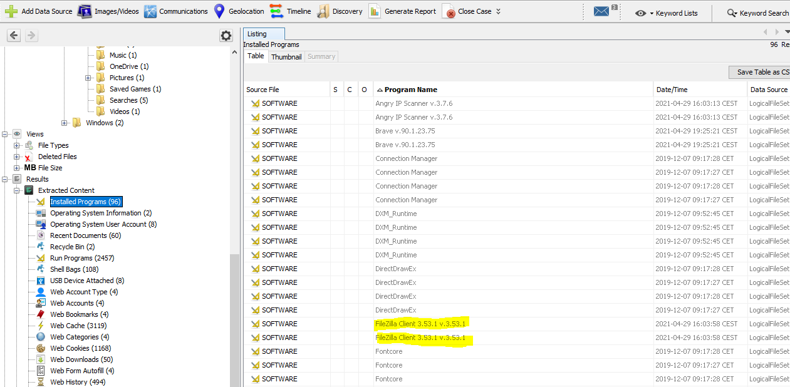

# Cyberdefenders

## African Falls


"John Doe was accused of doing illegal activities. A disk image of his laptop was taken. Your task is to analyze the image and understand what happened under the hood."

Starting image - ```DiskDrigger.ad1``` (ad1 - Forensic Toolkit FTK Imager Image files)
FTK Imager Log - ``` DiskDrigger.ad1.txt```

I will use [Flare VM](https://github.com/fireeye/flare-vm) machine with Autopsy.

### Autopsy

> Autopsy is the premier open source forensics platform which is fast, easy-to-use, and capable of analyzing all types of mobile devices and digital media. **Its plug-in architecture enables extensibility from community-developed or custom-built modules.** Autopsy evolves to meet the needs of hundreds of thousands of professionals in law enforcement, national security, litigation support, and corporate investigation.

Modules are powerful - [Awesome-list](https://github.com/CarlosLannister/awesome-autopsy-plugins), [Mark McKinnon's plugins](https://github.com/markmckinnon/Autopsy-Plugins).
We can add modules by opening **Tools>Python Plugins** option. It will open place, where we can add modules. 

Autopsy by default cannot add .ad1 file to your open case. We need separate module - I found an Autopsy module called [AD1 extractor](https://markmckinnon-80619.medium.com/new-autopsy-modules-now-available-7c56d2032020). 


Go to **Add Data Source>Logical Files>Local Files and Folders** (choose .ad1 file).
Then we have **Configure Ingest Module** window - mark **AD1 Extractor** and run.


Unfortunally, It obtain Prefetch info only... IDK why. In that case I will export all files from .ad1 in FTK Imager to specified folder and add it as new Data Source to Autopsy.

We are ready to dig in!

### 1. What is the MD5 hash value of the suspect disk?
We need to verify FTK Imager log file to obtain that value.


> TIP: To calc the MD5/SHA256 of a file in Windows we can use `certutil` command:

```
certutil -hashfile DiskDrigger.ad1 <MD5/SHA256>
```
> Executing above command without <> parameter will compute us SHA1 by default.

### 2. What phrase did the suspect search for on 2021-04-29 18:17:38 UTC? (three words, two spaces in between)

To check that we need to obtain browser search log. We can use Ingest module - **Recent Activity** to added Data Source.


By doing this we obtain many interesting information. Let's try to answer - dig in web search.
Sort by date.

> NOTE: we have CEST time in Autopsy - its +2 hours later than UTC time.

In a result, our John Doe on 2021-04-29 18:17:38 UTC searched in Chrome browser for 'password cracking lists'.


### 3. What is the IPv4 address of the FTP server the suspect connected to?

If you jump to question 7 you will see that powershell log doesn't have any command related to FTP.
So if we check installed programs, we will see popular program to host our FTP server or being a FTP client - Filezilla.



Filezilla stores in `recentservers.xml` file information about recent FTP servers, where user are logged in.


### 4. What date and time was a password list deleted in UTC? (YYYY-MM-DD HH:MM:SS UTC)

Check the **Recycle Bin** tab.
> NOTE: we have CEST time in Autopsy -  its +2 hours later than UTC time.


### 5. How many times was Tor Browser ran on the suspect's computer? (number only)

To check that, we will verify Windows Prefetch info. It will inform us, if the Tor browser were opened at least one time (it will have a prefetch file, if John Doe opens it.
> Each time that you run an application in your system, a Prefetch file which contains information about the files loaded by the application is created by Windows operating system. The information in the Prefetch file is used for optimizing the loading time of the application in the next time that you run it.


It's says that John Doe runs a installer - let's check **Installed Programs** tab.


It's good to check also if John Doe downloaded it or having Tor installer from other source.


So, as you can see, John Doe downloaded and run instalation file and interupts it, so the answer is 0.


### 6. What is the suspect's email address?

Many users saves username's in browsers. So the good idea is to check **Web Form Autofill**.


Then to see where it was used, lets use the Timeline tool - select file and add it to timeline.

First one were used to run bettercap webui from 127.0.0.1 with bettercap username.


Check for second one - that's it! Timeline shows us successful login from user `dreammaker82` to protonmail inbox. So we have a answer!


### 7. What is the FQDN did the suspect port scan?


Nmap = port scanning mostly - so if we come back to question 5 and look closer to **Installed Programs** tab, we will see installed Nmap.
So we need to find commands executed by John Doe. 

First guess - CMD.exe - but I checked, that [CMD history is not stored by default](https://serverfault.com/questions/95404/is-there-a-global-persistent-cmd-history), only by manually executed comannd:
```
doskey /history > history.txt
```
Second guess - Powershell - [Powershell history provided by PSReadline extension is available by default for all if suspect runs windows 10 in specified path](https://superuser.com/questions/1000489/windows-powershell-how-to-view-commands-history-date-time):

```
C:\Users\<User>\AppData\Roaming\Microsoft\Windows\PowerShell\PSReadline\ConsoleHost_history.txt
```
Let's check it and find some nmap commands:


### 8. What country was picture "20210429_152043.jpg" allegedly taken in?

Let's run addtional **Ingest Module - Picture Analyzer** - it would obtain for us [EXIF Metadata](https://en.wikipedia.org/wiki/Exif) from all images.

> EXIF - Exchangeable image file format
> The metadata tags defined in the Exif standard cover a broad spectrum:
> - Date and time information. Digital cameras will record the current date and time and save this in the metadata.
> - Camera settings. This includes static information such as the camera model and make, and information that varies with each image such as orientation (rotation), aperture, shutter speed, focal length, metering mode, and ISO speed information.
> - A thumbnail for previewing the picture on the camera's LCD screen, in file managers, or in photo manipulation software.
> - Descriptions
> - Copyright information.
> - **GPS record**

Latitude and Longitude coordinates responds to the location, where the photo was taken.


We can check obtained info in google maps.


### 9. What is the parent folder name picture "20210429_151535.jpg" was in before the suspect copy it to "contact" folder on his desktop?

When we navigate to **Contact** folder and investigate mentioned image, we can see that photo were taken by LG Electronics device. 


So first guess - John Doe connected that device and copied file to local system. 
To check that, [shellbags](https://www.sans.org/blog/computer-forensic-artifacts-windows-7-shellbags/) will be the best.

> "Shellbag information is available only for folders that have been opened and closed in Windows Explorer at least once" 

In Shellbags tab in Autopsy, we can find browsed directories for LG device.


### 10. 	A Windows password hashes for an account are below. What is the user's password?

Given line is a dumped hashes format from pwdump tool, which points to `username:RID:LM hash:NTLM hash`

>RID - relative identifier (RID) is a variable length number that is assigned to objects at creation and becomes part of the object's Security Identifier (SID) that uniquely identifies an account or group within a domain.

```Anon:1001:aad3b435b51404eeaad3b435b51404ee:3DE1A36F6DDB8E036DFD75E8E20C4AF4:::```

Then we can use hashcat to crack NTLM hash (:

```
.\hashcat.exe -m 1000 -a 3 -w 3 -O 3DE1A36F6DDB8E036DFD75E8E20C4AF4 -1 ?l?d?s?u ?u?1?1?1?1?1?s -i --increment-min=5
```


### 11. What is the user "John Doe's" Windows login password?

To verify that we need to dump SAM and SYSTEM files from a forensic image.
```
C:/Windows/System32/config/SAM
C:/Windows/System32/config/SYSTEM
```
Then use [mimikatz](https://github.com/gentilkiwi/mimikatz/releases) to obtain password NTLM hash.
```
log dump.txt
lsadump::sam /system:C:\PATH\TO\SYSTEM /sam:C:\PATH\TO\SAM
lsadump::sam /system:C:\Users\tacola\Desktop\c48-Africanfalls\DiskDigger\SYSTEM /sam:C:\Users\tacola\Desktop\c48-Africanfalls\DiskDigger\SAM
```


John Doe NTLM HASH - ecf53750b76cc9a62057ca85ff4c850e

And then we can use [Hashcat](https://github.com/hashcat/hashcat) to bruteforce obtained NTLM hash. Number corresponding to NTLM in [hashcat manual](https://en.kali.tools/?p=155) is 1000. Good manual [here](https://cyberloginit.com/2017/12/26/hashcat-ntlm-brute-force.html).

I used [google Colab](https://colab.research.google.com/drive/1Ccyx3tHKkItiUSApaF0alZHjDwNXYmQm#scrollTo=ybNiPqfhyd4A) to crack NTLM.

```
.\hashcat.exe -m 1000 -a 3 -w 3 -O ecf53750b76cc9a62057ca85ff4c850e -1 ?l?d?s ?1?1?1?1?1?1?1?1?1 -i --increment-min=5
```


### PWNed!


### Timeline - John Doe's weird activity
```
04/28/2021 17:15:05 - downloaded Nmap.
04/28/2021 17:16:49 - downloaded bettercap.
04/28/2021 17:21:50 - downloaded Wireshark.
04/28/2021 17:24:05 - run bettercap to sniff the network.
04/28/2021 17:37:54 - run Nmap to scan the network.
04/28/2021 17:39:31 - run Wireshark.
04/29/2021 16:03:03 - downloaded Angry IP Scanner.
04/29/2021 16:21:22 - inserted USB.
04/29/2021 16:28:12 - run Angry IP Scanner.
04/29/2021 16:46:31 - downloaded Quick Crypto software to hide data.
04/29/2021 18:19:16 - downloaded TOR browser, but did not run it.
04/29/2021 18:20:22 - downloaded password wordlist to the USB.
04/29/2021 18:22:17 - deleted password wordlist from download folder.
04/29/2021 20:45:02 - downloaded SDelete software.
04/30/2021 00:28:40 - run Quick Crypto to hide data inside the picture.
04/30/2021 01:01:09 - run filezila and accessed FTP server (192.168.1.20).
04/30/2021 01:02:42 - accessed the accountNum folder.
04/30/2021 01:08:06 - run SDelete agenst accountNum to delete it.
```
